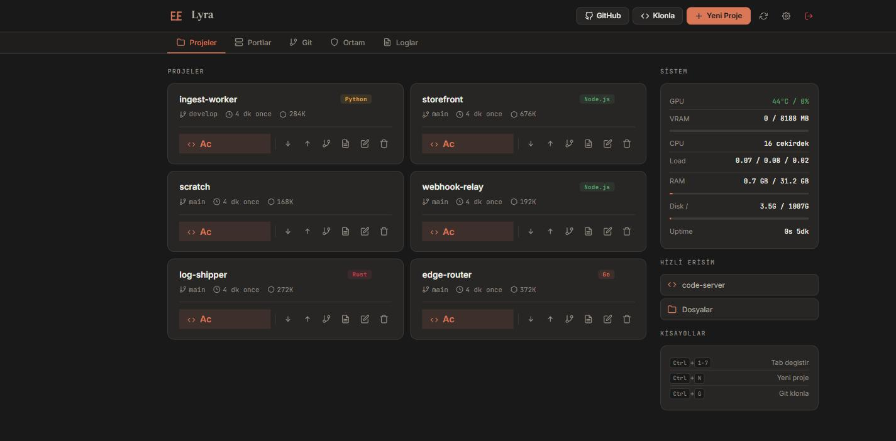
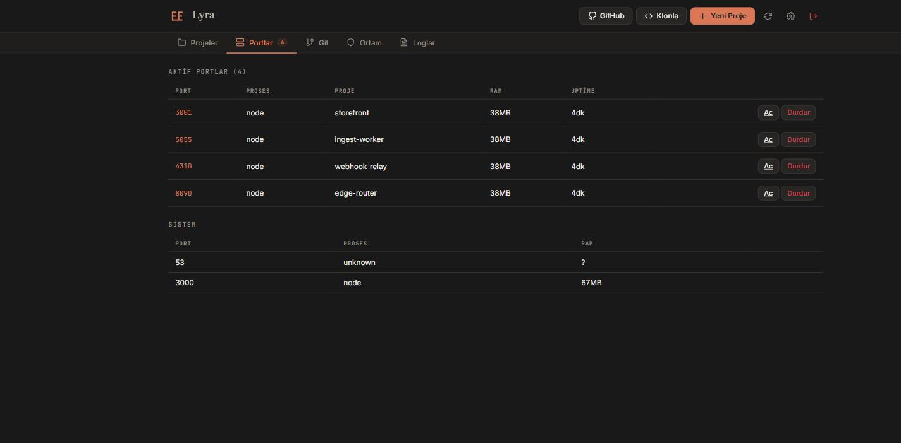
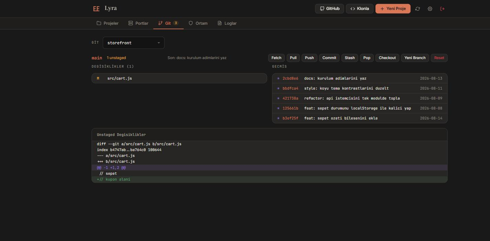
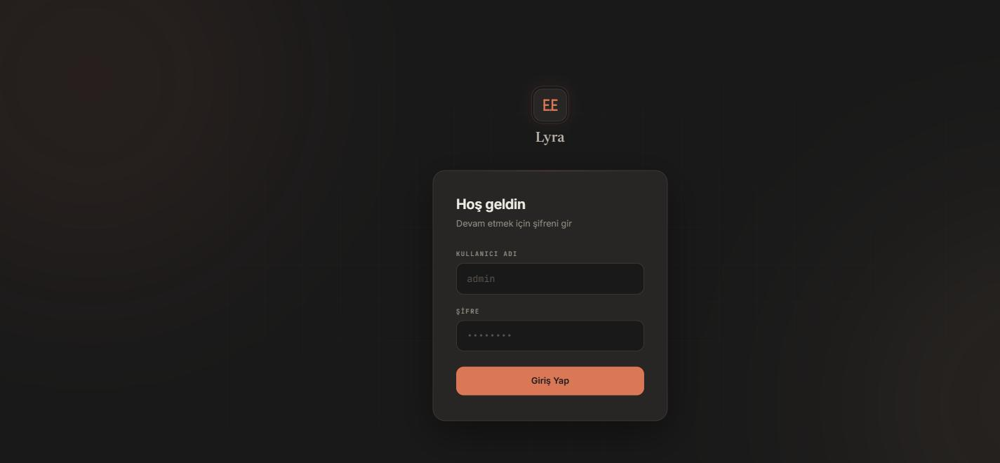

<p align="center">
  
</p>

<p align="center">
  Self-hosted geliştirici ortamı yönetim paneli — projeler, code-server,
  dev-port önizlemeleri, git, ortam değişkenleri, loglar, Docker ve
  Cloudflare Tunnel tek panelde. Kendi sunucunda.
</p>

<p align="center">
  <a href="https://github.com/eminerolll/andromeda-lyra/actions/workflows/ci.yml"></a>
  <a href="https://github.com/eminerolll/andromeda-lyra/releases/latest"></a>
  <a href="./LICENSE"></a>
  
</p>

<p align="center">
  
</p>

> **Durum: kullanılabilir, API'ler oturmadı.** Ubuntu 20.04 ve 22.04'te,
> Docker konteynerinde, WSL2'de ve gerçek bir bulut sunucusunda (Oracle
> Cloud) uçtan uca doğrulandı. Şema ve API'ler 1.0'a kadar değişebilir;
> yükseltmeler migration ile taşınır.

## Ne yapıyor

| Sekme                    | Yetenekler                                                                                                                 |
| ------------------------ | -------------------------------------------------------------------------------------------------------------------------- |
| **Projeler**             | GitHub repo klonla, şablondan oluştur (Node, Python, React, Next), favoriye ekle, code-server'da aç, yeniden adlandır, sil |
| **Portlar**              | Çalışan dev portlarının canlı listesi (proje / RAM / uptime), tek tıkla aç, takılan process'leri durdur                    |
| **Git**                  | Status, log, diff, pull/push/commit/checkout — conflict tespiti İngilizce + Türkçe git çıktısı için                        |
| **Ortam**                | Proje `.env` dosyalarını düzenle (monorepo destekli), global ortam değişkenleri                                            |
| **Loglar**               | Kayıtlı her systemd unit için canlı `journalctl` akışı                                                                     |
| **Docker** _(opsiyonel)_ | Container'lar, stats, compose up/down, proje logları                                                                       |
| **Tunnel** _(opsiyonel)_ | Cloudflared ingress + DNS rotaları UI'dan                                                                                  |

Varsayılan **sadece LAN**. Public erişim opt-in — kendi reverse proxy'n
ile (Cloudflare Tunnel, Tailscale Funnel, Caddy, …).

## Ekranlar

<table>
  <tr>
    <td width="50%"><br><sub><b>Portlar</b> — çalışan dev server'lar, hangi projeye ait, RAM ve uptime; tek tıkla aç ya da durdur</sub></td>
    <td width="50%"><br><sub><b>Git</b> — status, commit geçmişi, diff; pull/push/commit/checkout tarayıcıdan</sub></td>
  </tr>
  <tr>
    <td colspan="2" align="center"><br><sub><b>Giriş</b> — şifre + opsiyonel TOTP 2FA, otomatik IP ban</sub></td>
  </tr>
</table>

## Hızlı başlangıç

Temiz bir Ubuntu sunucuda tek komut:

```bash
git clone https://github.com/eminerolll/andromeda-lyra.git lyra && cd lyra
sudo ./install.sh
```

Script sistem paketlerini ve Node 20'yi kurar, kodu `/opt/lyra`'ya yerleştirir,
`/var/lib/lyra`'yı hazırlar, systemd unit'ini ve sudoers dosyasını yazar. Sonra
**panele nasıl erişeceğini sorar** — bu soru sihirbaz başlamadan önce gelir,
çünkü yanlış cevap seni erişemeyeceğin bir URL'e gönderir:

1. **Cloudflare domain'im var** — API token + domain verirsin; tunnel, DNS ve
   `cloudflared` hemen kurulur, sihirbaz `https://lyra.alanadin.com` üzerinde
   açılır. **Hiçbir port açılmaz**, NAT/CGNAT ve bulut firewall'u arkasında da
   çalışır.
2. **Bu makine dışarıdan erişilebilir** — sihirbaz `http://<ip>` üzerinde açılır.
3. **Ne domain ne açık port** — sihirbaz o terminalde çalışır (CLI).

`install.sh` bulut sunucu (Oracle/AWS/GCP/Azure) tespit ederse uyarır ve 2. seçeneği varsayılan yapmaz: bu sağlayıcılarda gelen portlar Security List /
NSG katmanında varsayılan olarak kapalıdır, `ufw` kapalı olsa bile.

Sihirbaz bitince Lyra kurulum modundan kendi çıkar ve normal moda geçer.
Terminal sihirbazı sonradan da çağrılabilir — aynı soruları sorar, aynı kodu
çalıştırır:

```bash
sudo systemctl stop lyra
cd /opt/lyra/src && sudo -u <kullanici> LYRA_HOME=/var/lib/lyra node scripts/setup-cli.js
```

Kurulumdan sonra günlük işler tek komutta:

```bash
lyra status          # servis, erişim modu, panel adresi, DB boyutu
lyra logs            # journalctl -u lyra -f
sudo lyra update     # kod + bağımlılık + migration + restart
sudo lyra uninstall  # ne silineceğini listeler, onay ister
```

Adım adım rehber, ortam değişkenleri, non-interactive bayrakları ve sorun
giderme için: **[INSTALL.md](./INSTALL.md)**.

## Gereksinimler

- **Ubuntu 20.04+ / Debian 12+** (apt + systemd), x86_64 veya aarch64
- **root erişimi** (`sudo`)
- Node.js 20, `git`, `ss` (iproute2), `build-essential` — `install.sh` eksikse
  kendisi kurar
- Yönetilen servisler (`code-server`, `filebrowser`, `dbgate`, `mongod`):
  kuruluysa tespit edilir, değilse **sihirbazda seçince Lyra kurar** —
  amd64 ve arm64 için. `dbgate` Docker ister; Docker otomatik kurulmaz,
  yoksa seçenek sebebiyle birlikte devre dışı kalır
- Public mod seçilirse Caddy, CF Tunnel modu seçilirse cloudflared kurulum
  sırasında otomatik kurulur

> Kurulan her servis yalnızca `127.0.0.1`'e bind edilir ve kendi auth'unu
> kapatır: dışarıya tek kapı Lyra'nın login + 2FA + ban katmanıdır.

## Mimari

```
                   ┌─────────────────────────────┐
                   │       Lyra (Node 20)        │
                   │   Express + ws + http-proxy │
   tarayici ──TLS─▶│                             │
                   │   ┌──────────┐  ┌────────┐  │
                   │   │ routes/  │  │  lib/  │  │
                   │   └────┬─────┘  └───┬────┘  │
                   │        ▼            ▼       │
                   │   ┌─────────────────────┐   │
                   │   │    SQLite (WAL)     │   │
                   │   │ settings · services │   │
                   │   │ users · sessions    │   │
                   │   │ bans · audit_log    │   │
                   │   │ integrations        │   │
                   │   └─────────────────────┘   │
                   └────────────┬────────────────┘
                                │ reverse proxy
              ┌─────────┬───────┴────────┬───────────┐
              ▼         ▼                ▼           ▼
         code-server  cloudflared    filebrowser   dbgate
```

İki konfigürasyon katmanı:

- **`.env`** — bootstrap için 3 anahtar (`LYRA_HOME`, `LYRA_PORT`,
  `NODE_ENV`). `install.sh` üretir (`/opt/lyra/src/.env`, `0600`) ve aynı
  değerleri systemd unit'ine `Environment=` olarak da yazar.
- **SQLite** — geri kalan her şey: domain, port eşlemeleri, servisler,
  kimlik bilgileri, oturumlar, banlar, audit log. Varsayılan konum
  `/var/lib/lyra/lyra.db` (`0700` dizin, `0600` dosya). Runtime'da
  düzenlenebilir.

Detaylar için [`docs/architecture.md`](./docs/architecture.md).

## Güvenlik modeli

- Sadece loopback (`127.0.0.1`) bind. Public erişim için kendi reverse
  proxy'ni kullan.
- Şifre (≥12 karakter) + opsiyonel TOTP 2FA. **Default kimlik bilgisi
  yok** — admin oluşturulana kadar uygulama hizmet vermez.
- Başarısız girişlerden sonra otomatik IP ban (eşik ve süre yapılandırılabilir).
- Oturum aynı SQLite DB'de saklanır; cookie `httpOnly`, `sameSite=lax`,
  `secure` sadece public mode'da.
- Tüm API route'ları `requireAuth` arkasında — küçük public allowlist
  (`/login`, `/healthz`, `/setup-status`, `/api/branding`).
- SQLite DB ve `.env` dosyaları `0600` izniyle yazılır.
- Kalıcı sudoers entry'si (`/etc/sudoers.d/lyra`) **sadece** Lyra'nın ihtiyacı
  olan komutları whitelist'ler — sabit yollar, dar wildcard'lar, `NOPASSWD: ALL`
  yok.
- Kurulum fazı bunun istisnasıdır: Caddy/cloudflared'i apt+dpkg ile kurmak
  gerçek root ister. `install.sh` bunun için **geçici** bir
  `/etc/sudoers.d/lyra-setup` yazar ve sihirbaz bitince Lyra dosyayı siler.
  Kurulum yarıda kalırsa elle silinmeli (bkz. INSTALL.md).
- systemd unit'inde `ProtectHome` ve `NoNewPrivileges` bilinçli olarak yok
  (projeler dizinine yazma ve setuid `sudo` gerekiyor); `ProtectSystem=full` +
  hedefli `ReadWritePaths` kullanılır.

Tehdit modeli ve güvenlik açığı raporlama için [SECURITY.md](./SECURITY.md).

## Dokümantasyon

- [INSTALL.md](./INSTALL.md) — GitHub'dan kurulum, adım adım
- [docs/architecture.md](./docs/architecture.md) — sistem tasarımı
- [docs/configuration.md](./docs/configuration.md) — ayar referansı
- [docs/deployment.md](./docs/deployment.md) — erişim modelleri ve dağıtım
- [docs/security.md](./docs/security.md) — operatör sertleştirme notları
- [CHANGELOG.md](./CHANGELOG.md) — sürüm geçmişi
- [CONTRIBUTING.md](./CONTRIBUTING.md) — kod stili, branching, PR'lar
- [SECURITY.md](./SECURITY.md) — güvenlik açığı raporlama

## Geliştirme

```bash
cd src
npm install
npm test           # vitest — 377 test
npm run lint
npm run format:check
```

CI her push'ta Node 20 ve 22 üzerinde lint + format + testleri koşar.

## Lisans

[AGPL-3.0](./LICENSE).

AGPL seçimi bilinçli: bir bulut sağlayıcı projeyi managed servis olarak
sarmalasa bile proje açık kalır. Lyra'yı kendi sunucunda çalıştırıp
dağıtmıyorsan AGPL sana hiçbir yükümlülük getirmez.
